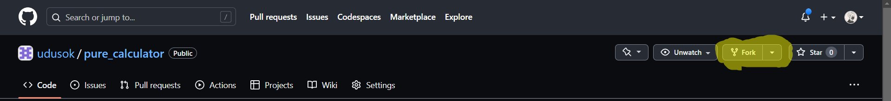
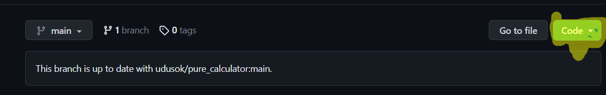
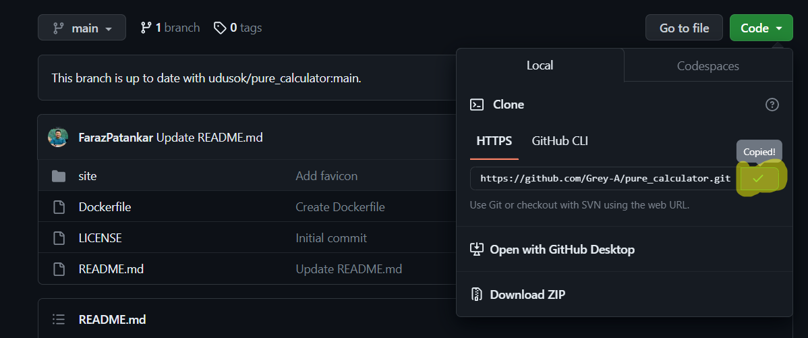
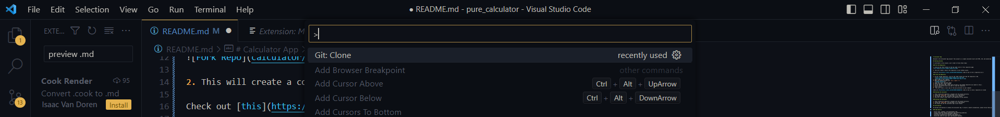
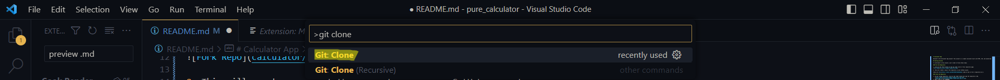
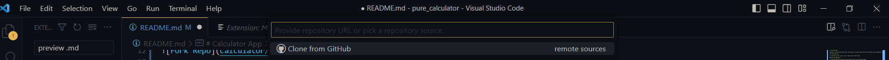
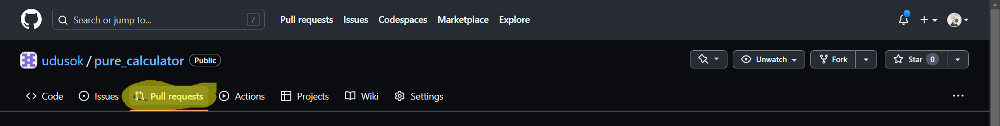
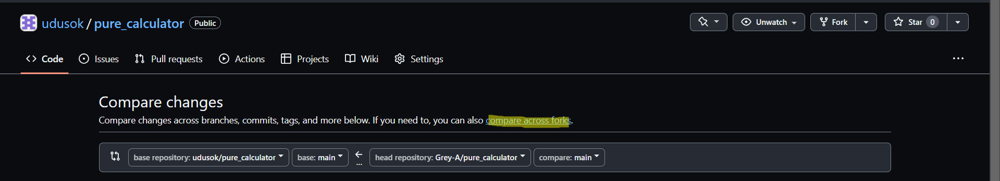

# Python Project Repository

Welcome to the Python Project Repository! This repository contains a collection of Python projects aimed at beginners, covering a variety of interesting functionalities and applications.

## Project Structure

The repository is structured as follows:

- `main.py`: The entry point of the project. Use this file to run and test different functionalities or projects by importing and using modules from other directories.

- `games/`: Contains different game modules. Each module represents a separate game project. You can find individual games like Number Guessing Game, Hangman Game, Quiz Game, and Adventure Game in this directory.

- `applications/`: Holds various application modules. Each module represents a separate application project. You can find individual applications like Todo List, Weather App, URL Shortener, File Organizer, and Currency Converter in this directory.

- `utilities/`: Contains utility modules or helper functions that can be shared across different projects. For example, the `scraper.py` module provides web scraping functionality used by multiple applications.

## Getting Started

To contribute to this project, you'll need to follow these steps:

### Fork the Repository

1. Click on the "Fork" button at the top right corner of this repository page.

2. This will create a copy of the repository in your GitHub account.

Check out [this](https://vimeo.com/835173929/5a5616a5ae) video on how to fork a repository do it.

### Clone the Repository

1. On your forked repository, click on the "Code" button and copy the repository's URL.
   
   
2. Open vscode on your computer
3. Open the command palette with `Ctrl + Shift + P`.
   
4. Type "git clone" and press Enter.
   
5. Select the "Git: Clone" command.
6. In the "Repository URL" field, paste the URL of the GitHub repository you copied in step 1.
   
7. Select the location where you want to clone the repository.
8. Click "Clone".
9.  This will create a local copy of the pure_static on your computer

Check out [this](https://vimeo.com/835176096/4bb8d6d746) video on how to clone a repository on vscode 

## Contributing

We welcome contributions to enhance the Project. To ensure a smooth collaboration, please follow these guidelines:

### Code Quality

- Write clean, readable, and maintainable code.
- Follow consistent naming conventions and formatting guidelines.
- Document your code using meaningful comments.
- Use proper indentation to improve code readability, using the prettier vscode extension is recommended.
- Write unit tests to cover your code for each function or the like.

### Contributing Guidelines

1. Create a new branch for your contributions:
   `git checkout -b feature/my-feature`
    Replace `my-feature` with a descriptive name for your feature or bug fix.
2. Commit your changes with clear and descriptive commit messages:
    `git commit -m "Add feature: Description of the feature"`
3. Push your changes to your forked repository:
   `git push origin feature/my-feature`
4. Open a pull request (PR) on the original repository:
- Go to the original repository on GitHub `https://github.com/udusok/python-projects`. 
- Click on "Pull requests" and then "New pull request."
  
  
- Click on Compare against forks.
  
- Provide a clear title and description for your pull request, explaining the changes made.
5. Wait for the code review and address any feedback received.

## Running the project
1. Execute the `main.py` file to run the project
2. Explore the different functionalities and projects available in the repository. Import modules from the respective directories to use them in your own code or run the individual project files for specific functionality.